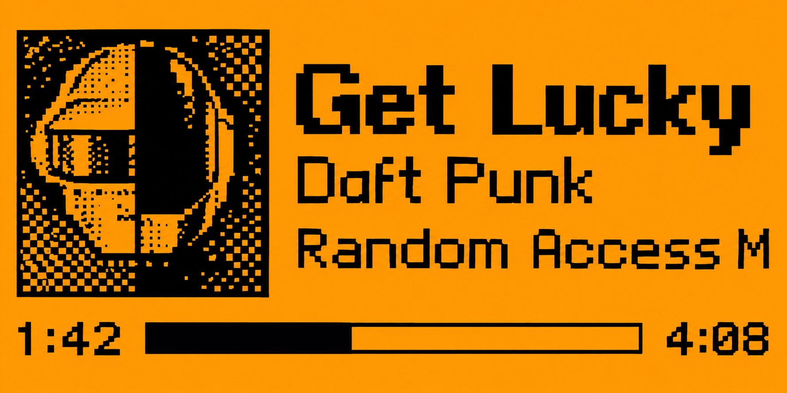

# Now Playing

**Your music, on your Flipper.** Album artwork, live track information, and pocket-sized playback controls.

**Bluetooth · Media** &nbsp; | &nbsp; **Release v0.2** &nbsp; | &nbsp; **Flipper Zero + Android 8.0+**

### Download & install

**[⬇ Download the Android APK](https://github.com/villenull/flipper-now-playing/releases/download/v0.2/flipper-now-playing-debug.apk)** — open this link on your phone, download, and tap to install.

**[⬇ Download the Flipper app (.fap)](https://github.com/villenull/flipper-now-playing/releases/download/v0.2/now_playing-fw1.4.3-api87.1.fap)** · [All release files](https://github.com/villenull/flipper-now-playing/releases/tag/v0.2) · [Detailed installation guide](docs/INSTALL.md)

> **Preview release.** Built for official Flipper firmware **1.4.3 / API 87.1**. Hardware acceptance is still in progress. Update both the APK and FAP for artwork. The APK can update the previous helper in place.

> **Also available: one Flipper Now helper for both companions.** It pairs Now Playing plus the [Flipper Next Turn](https://github.com/villenull/flipper-next-turn) navigator (`NT…` advert) from a single app with one-tap pairing: [⬇ Download Flipper Now](https://github.com/villenull/flipper-next-turn/releases/download/v1.0/flipper-now-debug.apk). Same signing identity, so it upgrades this helper in place.

## Screen preview



Concept render of the approved layout. The actual 128×64 display is coarser; see the [native production-renderer example](docs/media/playing-native.png).

## What does Now Playing do?

Now Playing turns your Flipper Zero into a small display and remote for music on your Android phone. A companion Android helper reads the selected player's media session and sends updates over a dedicated Bluetooth connection.

- **Album artwork** in a 45×45 monochrome cover.
- **Song, artist, and album** alongside the artwork.
- **Live progress**, with elapsed/total or remaining time.
- **Playback and volume controls** through the Flipper's physical buttons.
- **Apple Music by default**, with another observed player or Auto selectable in the helper.

Apple Music and the official Flipper Android app stay unchanged. This is a separate APK and external FAP; it does not require a firmware fork.

## How to use

1. **Install the Android helper.** Download the APK above on your phone and tap it. If Android prompts, allow installation from your browser. To update, stop the helper first and install over the existing version.
2. **Copy the Flipper app.** With Now Playing closed, use qFlipper to copy the FAP to `SD Card/apps/Bluetooth/now_playing.fap`. No firmware flashing is involved.
3. **Open Now Playing on the Flipper.** Go to **Apps → Bluetooth → Now Playing**. Disconnect any active management connection in the official Flipper Android app.
4. **Connect from the helper.** Grant Bluetooth and notification access, tap **Find Now Playing devices**, select your device, and tap **Start**. Confirm the matching pairing code on both devices.
5. **Play a song.** Start playback in Apple Music. Track information will appear once the connection is ready.

The helper's ongoing notification includes **Stop**. After a reboot or force-stop, open the helper and press Start again. For Android's sideloaded-app settings and troubleshooting, see the [installation guide](docs/INSTALL.md).

## Controls

The screen leaves room for your music; there is no button legend.

| Flipper button | Action |
|---|---|
| Up / Down | Volume up / down; hold to repeat |
| Left / Right | Previous / next track |
| OK | Play / pause |
| Hold Back | Exit and restore the default Bluetooth profile |

## Artwork & scrolling

Artwork is resized and dithered on the phone. If the player does not supply an accessible image, a music note appears instead. The helper reads embedded media artwork or a readable local content URI; it does not download covers from the web.

Each long song, artist, or album name **pauses at the beginning for five seconds**, scrolls to reveal the rest, pauses briefly at the end, and repeats. Names that fit stay still. Display text is normalized to printable ASCII; the phone preview retains the original text.

## Privacy & requirements

- Android **8.0 / API 26 or newer**; Bluetooth and user-enabled notification access.
- Flipper Zero with an SD card and **official firmware 1.4.3 / API 87.1**.
- No Internet permission, backend, Apple credentials, root, analytics, or listening-history database.
- Notification access is used for media-session access; unrelated notification content is not collected.
- The app uses its own Bluetooth identity and bond storage.

The connected **Momentum mntm-012 / API 87.1** device accepted the FAP and was reopened after installation. This is not a claim of full Momentum or newer-firmware compatibility. See [compatibility](docs/COMPATIBILITY.md).

## Validation status

The local build passes **30 reference tests**, **17 Kotlin/Android unit tests**, **C ASan/UBSan**, **722 valid + 731 malformed cross-language cases**, Android lint, eleven native screen checks, and five actual artwork-reader tests on an Android emulator. USB installation on the connected Flipper was verified by reading the file back.

**Still awaiting physical acceptance:** phone-to-Flipper artwork, pairing and rapid track changes, background/Android 17 volume, bond preservation, and endurance. [Build report](docs/BUILD_REPORT.md) · [Hardware checklist](docs/HARDWARE_VALIDATION.md) · [Checksums](https://github.com/villenull/flipper-now-playing/releases/download/v0.2/SHA256SUMS)

## Changelog

### v0.2

- One-click setup: a single Connect button walks Bluetooth permission, media access, and Flipper selection in order; tapping the found Flipper starts immediately.
- Player choice, elapsed/remaining, diagnostics, and change/forget move to collapsed Advanced. Same package and signing certificate; updates v0.1 in place.

### v0.1

- Add 45×45 album artwork with a missing-cover fallback.
- Put track details to the right and time/progress below.
- Pause long names for five seconds before scrolling.
- Remove on-screen button indicators; keep every physical control.
- Add negotiated artwork support while allowing older peers to connect without it.
- Fix the SD-card startup check that prevented the first preview from opening.
- Add artwork conversion, stale-data, native-render and Android device-level tests.

## Build from source

```sh
./scripts/bootstrap.sh --accept-android-sdk-license
./scripts/doctor.sh
./scripts/test_all.sh
python3 scripts/package_release.py
```

Read the Android SDK license before supplying its acceptance flag. Toolchains are pinned in [`.toolchains.lock.json`](.toolchains.lock.json) and installed under `.cache/`. Builds never flash firmware or install onto a device. Exact versions and results are in the [build report](docs/BUILD_REPORT.md).

## Credits & references

- [Official Flipper firmware](https://github.com/flipperdevices/flipperzero-firmware): exported API, BLE infrastructure, Canvas and native fonts.
- [Android media-session APIs](https://developer.android.com/reference/android/media/session/MediaSession): selected-player metadata and controls.
- [Anki Remote's catalog page](https://lab.flipper.net/apps/anki_remote): inspiration for this listing's organization.

The app icon follows the helper's existing music-note design. The orange concept render was generated from the approved design; the linked native example comes from this repository's production renderer. No proprietary album cover is bundled in the applications.

[GPL-3.0 license](LICENSE) · [Third-party notices](THIRD_PARTY_NOTICES.md) · [Report an issue](https://github.com/villenull/flipper-now-playing/issues)
